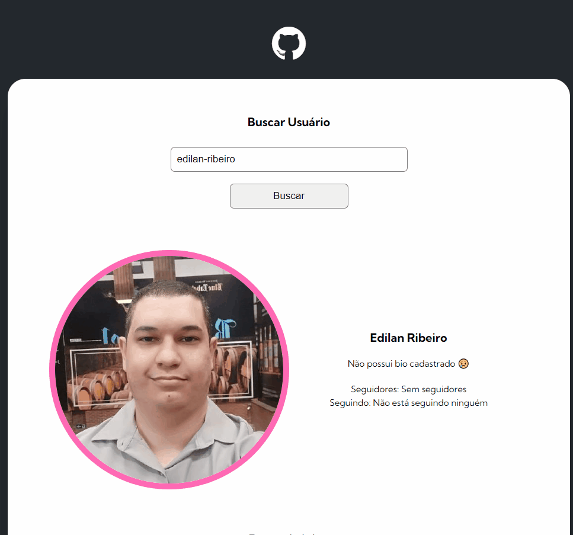

### <div align="center">Choose your language | Escolha seu idioma </div>

<div align="center">

[](https://github.com/edilan-ribeiro/project-github-api/blob/main/README.en.md)
[](https://github.com/edilan-ribeiro/project-github-api/blob/main/README.md) 


</div>
<br>
<a name="readme-top"></a>


<br />
<div align="center">
    <a href="https://github.com/edilan-ribeiro/project-github-api">
    
  </a>

<h3 align="center">Project with fetch and GitHub api</h3>

  <p align="center">
    In this project you can search for a github user to get some important informations
  </p>
  
  <a href="https://edilan-ribeiro.github.io/project-github-api">View Demo</a>
</div>

<br>

<details>
  <summary>Table of Contents</summary>
  <ol>
    <li>
      <a href="#about-the-project">About The Project</a>
      <ul>
        <li><a href="#built-with">Built With</a></li>
        <li><a href="#highlights">Highlights</a></li>
        <li><a href="#challenges-and-lessons-learned">Challenges and lessons learned</a></li>
      </ul>
    </li>
    <li><a href="#contact">Contact</a></li>
  </ol>
</details>

<br><br>

## About The Project



<br>

This project allows user data search on github and returns valuable information such as name, bio, followers, image and repositories data.

An API, or Application Programming Interface, is a set of rules and protocols that allow different software to communicate and interact with each other efficiently. They are essential for modern application development, especially when it comes to building complex and scalable services.


<br>
<strong>Project on mobile</strong>:

<br>


<p align="right">(<a href="#readme-top">back to top</a>)</p>


### Built With


<p align="right">(<a href="#readme-top">back to top</a>)</p>


## Highlights

<br>

Initial layout provided by devemdobro on github
<a href="https://github.com/devemdobro/projeto-inicial-fetch-github-api" target="_blank"> you can check this base layout by clicking here</a>

<br>

The highlights of this page include:

- Responsive layout
- Search by user name
- Error messages
- Recent events by a github user
- Aditional info on user github repositories 

<p align="right">(<a href="#readme-top">back to top</a>)</p>

### Challenges and lessons learned


🗨 Inserting data via javascript using HTML tags instead of just putting the text in the ready-made HTML element was certainly a new addition to this dev's utility belt.


📱 When the code was ready I deleted a repository and to my surprise things stopped working! This allowed me to catch an error that was unexpected by the code until now.

When a repository is recently deleted from github the API keeps reporting the repository deleted in recent activity, but it does not report its events, as the event message depends on reading the array in ```repoEvent.payload.commits[0].message``` the code stops running.

To solve this problem it is necessary to identify the existence of the array BEFORE trying to read it, like this:
<br>

``` 
repoEvent.payload.commits?.[0]?.message ?? '⚠ Não há mensagem de commit!'

```


😵 The API documentation is slightly confusing and leads to a new problem, repositories that were made by a fork and where no commit was made don't return information about the programming language used when a programming language was clearly used, in addition to that the api does not distinguish between repositories with programming languages and repositories with readme only.

In summary, I was able to learn:

- Inserting HTML tags through JavaScript
- Division of responsibilities does not always go as planned
- Libraries and frameworks can help a lot in certain functions (although they have not been used here)

## Contact

💌 To send me a message, just use one of the buttons below!<br>

  <a href = "mailto:edilanbusiness@gmail.com" target="_blank"></a>
  <a href="https://www.linkedin.com/in/edilan-ribeiro-santos" target="_blank"></a> 
  <a href="https://whatsa.me/5561983769634/?t=Hello,%20I%20came%20from%20your%20GitHub!" target="_blank">
  </a>


<p align="right">(<a href="#readme-top">back to top</a>)</p>
